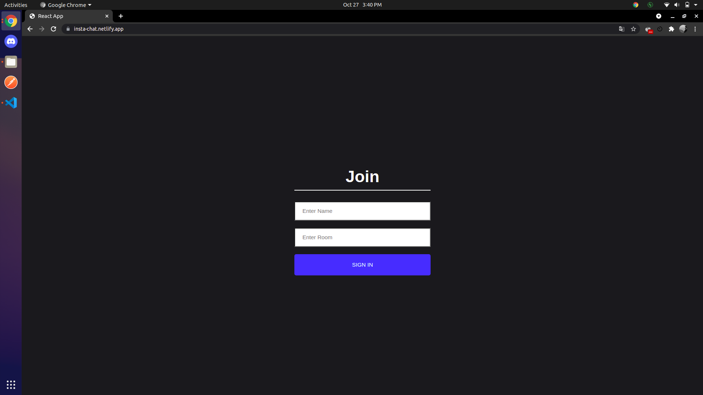
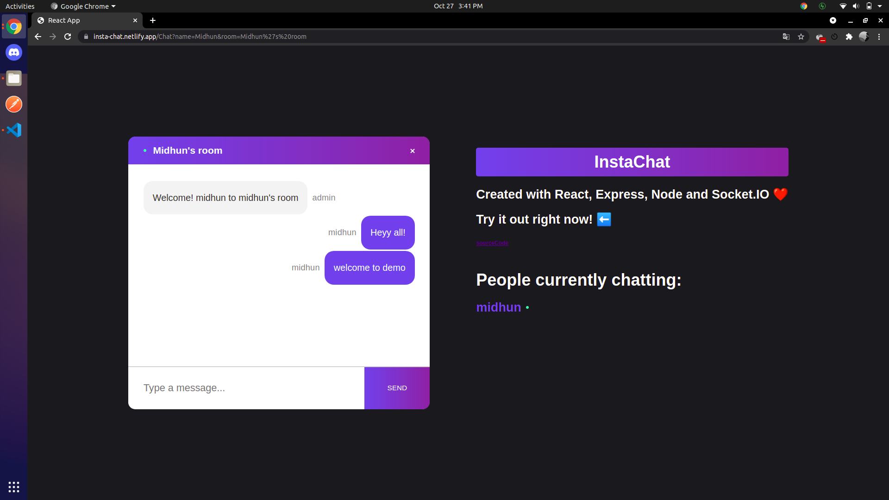

# insta-chat
### [Live Site](https://insta-chat.netlify.app/)
### ScreenShots


Instachat is a real-time chat app made with ReactJs on the front-end and ExpressJs , NodeJS , Socket.io web socket library on the back end.

Setup:
- run ```npm i && npm start``` for both client and server side to start the development server

